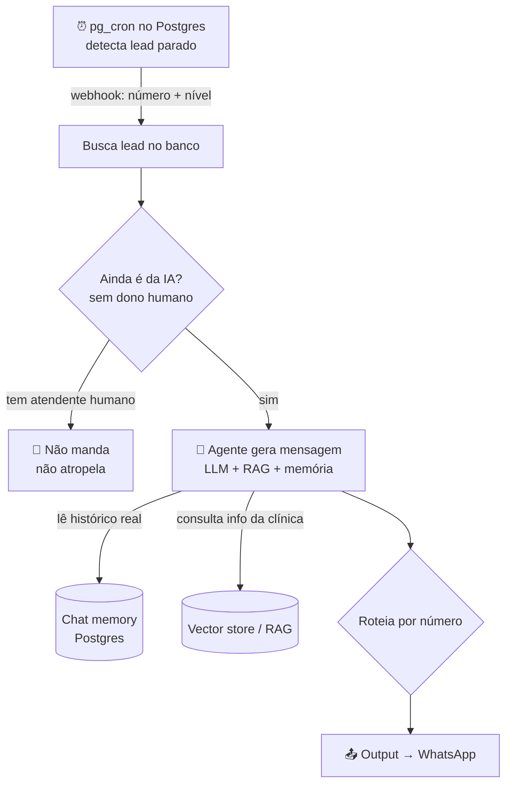

# 💬 Follow-up Automático com IA

> Reativa **leads parados** com uma mensagem gerada por IA — contextual, no tom certo e **sem soar robótico ou cobrador**. Escalona em níveis: do "puxa assunto de novo" até o "encerra com dignidade".

> 🔒 **Case anonimizado.** Sem nome de cliente, credenciais ou dados reais.

---

## 🎯 O problema

A maior parte dos leads **não responde de primeira**. Some no meio da conversa. Se ninguém retoma, o lead esfria e o investimento em tráfego vira prejuízo.

Mas follow-up manual é ruim: ou a equipe esquece, ou manda mensagem genérica ("Olá, ainda tem interesse?") que o cliente ignora — ou pior, soa como cobrança e queima o lead.

## ✅ A solução

Um pipeline que detecta o silêncio do lead e gera, via IA, uma mensagem de reativação **personalizada com base no histórico real da conversa**. Cada nível de follow-up muda o ângulo e o tom:

| Nível | Quando dispara | Estratégia |
|---|---|---|
| **02** | ~120 min de silêncio | Complementa a última mensagem, conecta com algo que o lead disse + CTA |
| **03** | escalonado | Traz informação nova sobre o objetivo do lead |
| **04** | escalonado | Retoma algo pendente, tom pessoal, nova perspectiva |
| **05** | escalonado | Muda o ângulo, empático, sem cobrança |
| **06** | último | Encerra com dignidade — curto, sem pressão |

---

## 🏗️ Arquitetura

### Como funciona

1. **Gatilho via banco** — o `pg_cron` do Postgres monitora quem parou de responder e, no tempo certo, dispara um webhook com o número do lead, o nível de follow-up e o motivo.
2. **Triagem** — confirma no CRM que o lead **ainda não tem dono humano**. Se um atendente assumiu, a IA fica quieta.
3. **Geração da mensagem** — um agente (LLM) lê o **histórico real** da conversa (a mesma memória do agente principal, então ele "lembra" do que já foi falado), consulta a base de conhecimento da clínica via RAG, e escreve uma mensagem curta seguindo a estratégia daquele nível.
4. **Entrega** — roteia para o número correto e dispara no WhatsApp.

---

## 🧩 Destaques técnicos

- **Agendamento no banco, não no n8n:** o `pg_cron` decide *quando*, mantendo a lógica de tempo perto dos dados (quem está parado e há quanto tempo). O n8n só executa.
- **Memória compartilhada:** usa a **mesma** chat memory do agente principal (chave = número do lead) — o follow-up nunca repete argumento já usado e dá continuidade natural.
- **Escalonamento estratégico:** 5 níveis com prompts distintos evitam a sensação de mensagem automática repetida.
- **Não-atropelo:** três condições liberam o envio (contato com a IA, sem dono, ou inexistente no CRM); qualquer dono humano cancela o disparo.
- **Saída estruturada:** o agente devolve JSON (`{ "message": "..." }`), parseado antes do envio — e pode decidir **não mandar** (mensagem vazia) se não valer a pena.

> 🔎 *Boas práticas mapeadas durante o projeto:* validar `message != ""` antes de disparar e envolver o parse do JSON em try/catch — exatamente o tipo de dívida técnica que documento em cada entrega.

## 🧰 Stack

| Camada | Tecnologia |
|---|---|
| Agendamento | Postgres `pg_cron` + `pg_net` |
| Orquestração | n8n |
| Geração | OpenAI (Agent + File Search/RAG) |
| Memória | Postgres Chat Memory |
| CRM | GoHighLevel |

## 📈 Resultados

- 🔄 **Reativa lead parado** com mensagem que parece humana — não some receita por silêncio.
- 📅 **Recupera agendamento** de quem já tinha sumido da conversa.
- 🧠 Lembra do que já foi falado (memória compartilhada) — não repete argumento nem soa robótico.
- 🤝 Recua na hora se um atendente humano assume o lead.

<!-- iTristaoo: se tiver número real, some aqui (ex: "X% dos leads reativados voltam a responder"). Não invente. -->

---

## 🔗 Projetos relacionados

- [ai-receptionist-clinics](https://github.com/iTristaoo/ai-receptionist-clinics) — o agente principal cuja memória este follow-up reaproveita
- [rag-knowledge-base](https://github.com/iTristaoo/rag-knowledge-base) — a base que dá contexto real às mensagens
- [multitenant-clinic-dashboard](https://github.com/iTristaoo/multitenant-clinic-dashboard) — onde a clínica acompanha os follow-ups (`/followup`)

---

## 📲 Quer um agente desses no seu negócio?

**Construo automações e agentes de IA sob medida.** Bora conversar — me chama.

<!-- iTristaoo: troque pelos seus links reais → ex: [WhatsApp](https://wa.me/55SEUNUMERO) · [Email](mailto:seu@email.com) -->
